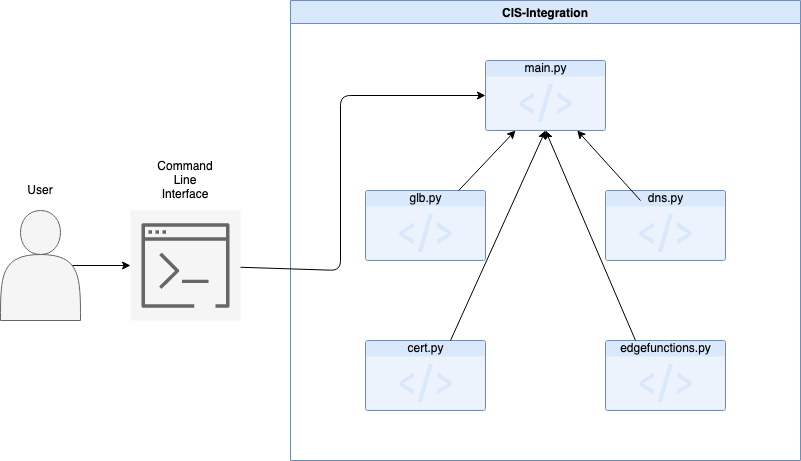

DISCLAIMER OF WARRANTIES:
Permission is granted to copy this Tools or Sample code for internal use only, provided that this
permission notice and warranty disclaimer appears in all copies.

THIS TOOLS OR SAMPLE CODE IS LICENSED TO YOU AS-IS.
IBM AND ITS SUPPLIERS AND LICENSORS DISCLAIM ALL WARRANTIES, EITHER EXPRESS OR IMPLIED, IN SUCH SAMPLE CODE,
INCLUDING THE WARRANTY OF NON-INFRINGEMENT AND THE IMPLIED WARRANTIES OF MERCHANTABILITY OR FITNESS FOR A
PARTICULAR PURPOSE. IN NO EVENT WILL IBM OR ITS LICENSORS OR SUPPLIERS BE LIABLE FOR ANY DAMAGES ARISING
OUT OF THE USE OF OR INABILITY TO USE THE TOOLS OR SAMPLE CODE, DISTRIBUTION OF THE TOOLS OR SAMPLE CODE,
OR COMBINATION OF THE TOOLS OR SAMPLE CODE WITH ANY OTHER CODE. IN NO EVENT SHALL IBM OR ITS LICENSORS AND
SUPPLIERS BE LIABLE FOR ANY LOST REVENUE, LOST PROFITS OR DATA, OR FOR DIRECT, INDIRECT, SPECIAL,
CONSEQUENTIAL,INCIDENTAL OR PUNITIVE DAMAGES, HOWEVER CAUSED AND REGARDLESS OF THE THEORY OF LIABILITY,
EVEN IF IBM OR ITS LICENSORS OR SUPPLIERS HAVE BEEN ADVISED OF THE POSSIBILITY OF SUCH DAMAGES.

# Application Flow

Above is a diagram which outlines how a user will interact with out application and outlines how our project will interact with itself. The user will utilize our applications functionality through the command line using `cis-integration`. Along with the `cis-integration` command a user will enter the needed information to connect their CIS instance to their application platform such as their CIS CRN, Zone ID, etc. With this information present the plug point for our application (main.py) will then call the needed functionality (glb creation, dns, certificate creation, and edge function creation) from their respective files. The functionalities listed above utilize the [CIS Python SDK](https://github.com/IBM/networking-python-sdk) called `ibm-cloud-networking-services`. The diagram and information mentioned above is subject to change as the project grows and matures.