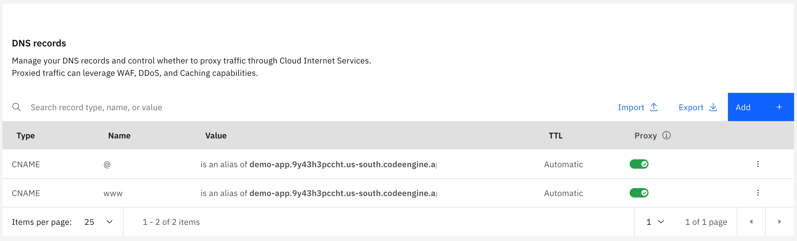
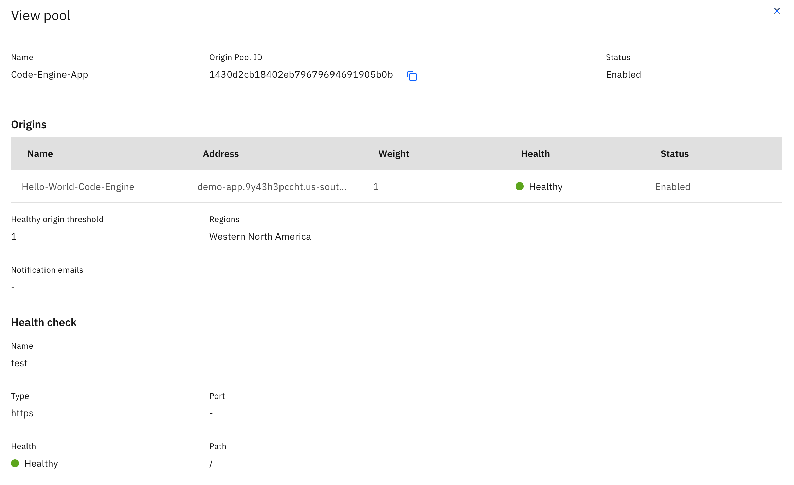
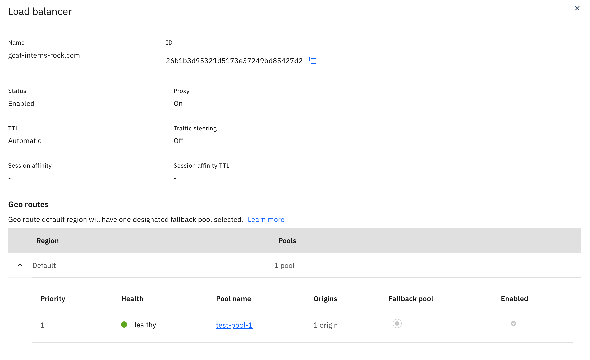

# Manual Steps
This document outlines the manual steps that were needed to connect IBM CIS and Code Engine.

## 1. Adding Domain Name to CIS Instance
Within the CIS console in the **Overview** tab add your domain name and configure DNS records from the application URL genereated by Code Engine and DNS records. DNS records are optional during this step and can be done later. Adding DNS records later can be done in the **Reliability** tab. In our situation we added two CNAME records named `@` and `www` with their values both being the application URL. For example, the application URL will look something like this `demo-app.9y43h3pccht.us-south.codeengine.appdomain.cloud`.



## 2. Configure Load-Balancer on CIS Instance
On the **Reliability** page first create a HTTPS health check. Name it and select HTTPS. Configure additional properties as needed. Note that the HTTPS port is 443.


Also on the **Reliability** page create an origin pool. Provide it a name, address, and select the health check you created. This address would be the same as the URL in the previous step. 


Next create a Load Balancer. Name it and add the origin pool you just created.


## 3. CIS Instance TLS Certificate Configuration
In the **Security** tab in CIS either upload or order the needed edge certificates for your hostname.


## 4. Edge Functions
Now edge functions (action and triggers) are added on the **Edge Functions** tab in CIS. First create an action with the following javascript code:
```
addEventListener('fetch', (event) => {
    const mutable_request = new Request(event.request);
    event.respondWith(redirectAndLog(mutable_request));
});
async function redirectAndLog(request) {
    const response = await redirectOrPass(request);
    return response;
}
async function getSite(request, site) {
    const url = new URL(request.url);
    // let our servers know what origin the request came from
    // https://developer.mozilla.org/en-US/docs/Web/HTTP/Headers/X-Forwarded-Host
    request.headers.set('X-Forwarded-Host', url.hostname);
    request.headers.set('host', site);
    url.hostname = site;
    url.protocol = "https:";
    response = fetch(url.toString(), request);
    console.log('Got getSite Request to ' + site, response);
    return response;
}
async function redirectOrPass(request) {
    const urlObject = new URL(request.url);
    let response = null;
    try {
        console.log('Got MAIN request', request);
        response = await getSite(request, APP_URL);
        console.log('Got MAIN response', response.status);
        return response;
    } catch (error) {
        // if no action found, play the regular request
        console.log('Got Error', error);
        return await fetch(request);
    }
}
```
where APP_URL is the URL of your Code Engine application.

Second, create a trigger that maps your applcations hostname with an action. For your trigger URL append `/*` to the end. For example, in our case the hostname would be `gcat-interns-rock.com/*`. Select the action you just created. 
