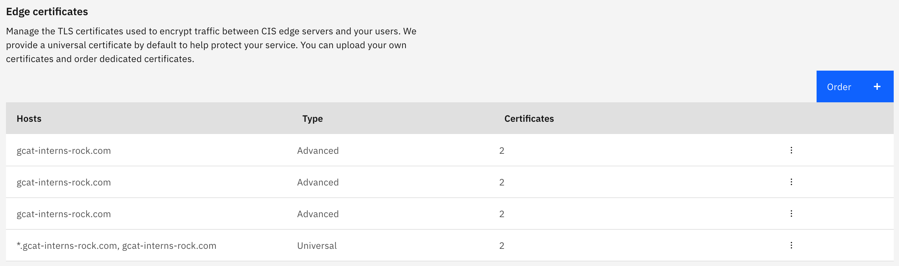

DISCLAIMER OF WARRANTIES:
Permission is granted to copy this Tools or Sample code for internal use only, provided that this
permission notice and warranty disclaimer appears in all copies.

THIS TOOLS OR SAMPLE CODE IS LICENSED TO YOU AS-IS.
IBM AND ITS SUPPLIERS AND LICENSORS DISCLAIM ALL WARRANTIES, EITHER EXPRESS OR IMPLIED, IN SUCH SAMPLE CODE,
INCLUDING THE WARRANTY OF NON-INFRINGEMENT AND THE IMPLIED WARRANTIES OF MERCHANTABILITY OR FITNESS FOR A
PARTICULAR PURPOSE. IN NO EVENT WILL IBM OR ITS LICENSORS OR SUPPLIERS BE LIABLE FOR ANY DAMAGES ARISING
OUT OF THE USE OF OR INABILITY TO USE THE TOOLS OR SAMPLE CODE, DISTRIBUTION OF THE TOOLS OR SAMPLE CODE,
OR COMBINATION OF THE TOOLS OR SAMPLE CODE WITH ANY OTHER CODE. IN NO EVENT SHALL IBM OR ITS LICENSORS AND
SUPPLIERS BE LIABLE FOR ANY LOST REVENUE, LOST PROFITS OR DATA, OR FOR DIRECT, INDIRECT, SPECIAL,
CONSEQUENTIAL,INCIDENTAL OR PUNITIVE DAMAGES, HOWEVER CAUSED AND REGARDLESS OF THE THEORY OF LIABILITY,
EVEN IF IBM OR ITS LICENSORS OR SUPPLIERS HAVE BEEN ADVISED OF THE POSSIBILITY OF SUCH DAMAGES.

# IKS Manual Steps
This document outlines the manual steps that are needed to connect IBM Cloud Internet Services (CIS) and IBM Kubernetes Service

## 1. Adding Domain Name to CIS Instance
Within the CIS console in the **Overview** tab add your domain name and then configure DNS records with the ingress subdomain present on your IKS Cluster. DNS records are optional during this step but must be done later in the **Reliability** tab in CIS if not done now. In our situation two CNAME DNS records were added to CIS named `@` and `www` with each of their values being the ingress subdomain from the IKS Cluster wanting to be connected.


## 2. CIS Instance TLS Certificate Configuration
In the **Security** tab in CIS either upload or order the needed edge certificates for your hostname



## 3. Configure IKS Service
From IBM Kubernetes Service navigate to the Kubernetes dashboard to deploy a service. Once in the Kubernetes dashboard click the plus icon in the top right of the page. There will then be three different options for deploying your service **Create from input**, **Create from file**, and **Create from form**. To deploy our service we will use **Create from form**, now fill in the required information. For **Service** field make sure we choose **Internal** and then specify the port and target port that we want to use.


## 4. (Optional) Importing CIS DNS Certificate into IKS Cluster
Now we import the CIS DNS certificate into our IKS Cluster using the command below. If you have this certificate in a certificate manager already then simply populate the fields as needed and run the below curl command. If you need to still obtain this certificate then navigate to to the certificate manager which is automatically created when an IKS Cluster is created.


Click the option to order using CIS and fill in the needed fields. Now populate the curl command and execute.

Note: To obtain your IBM Cloud IAM Access Token from the IBM Cloud CLI run the following command.
```
ibmcloud iam oauth-tokens
```

```
curl -X POST https://containers.cloud.ibm.com/global/ingress/v2/secret/createSecret \
    -H "Authorization: ${data.ibm_iam_auth_token.token.iam_access_token}" \
    -d '{
        "cluster" : "${data.ibm_container_vpc_cluster.cluster.id}",
        "crn" : "${ibm_certificate_manager_order.cert.id}",
        "name" : "${var.cert_name}",
        "namespace" : "${var.namespace}",
        "persistence" : true
    }'
```

## 5. Configure ACL Rules for VPC
To control traffic into the cluster we create network ACL rules which only allow internal cluster communication, subnet communication, and incoming traffic from Cloudflare. The implementation of these rules is done . Below is the complete list of ACL rules that are needed.

### General Rules

Description                           | Source CIDR             | Destination CIDR | Action | Direction
--------------------------------------|-------------------------|------------------|--------|-----------
Allow all traffic from peer subnet 1  | 10.10.10.0/24 (default) | Any              | Allow  | Inbound
Allow all traffic from peer subnet 2  | 10.10.20.0/24 (default) | Any              | Allow  | Inbound
Allow all traffic from peer subnet 3  | 10.10.30.0/24 (default) | Any              | Allow  | Inbound
IKS Create Worker Nodes               | 161.26.0.0/16           | Any              | Allow  | Inbound
IKS Create Worker Nodes               | 161.26.0.0/16           | Any              | Allow  | Inbound
Allow all outbound traffic            | Any                     | Any              | Allow  | Outbound
Deny all inbound traffic              | Any                     | Any              | Allow  | Inbound

### Cloudflare ACL Rules

Description                           | Source CIDR             | Destination CIDR | Port | Action | Direction
--------------------------------------|-------------------------|------------------|------|--------|-----------
Cloudflare IP 1                       | 103.21.244.0/22         | Any              | 443  | Allow  | Inbound
Cloudflare IP 2                       | 173.245.48.0/20         | Any              | 443  | Allow  | Inbound
Cloudflare IP 3                       | 103.22.200.0/22         | Any              | 443  | Allow  | Inbound
Cloudflare IP 4                       | 103.31.4.0/22           | Any              | 443  | Allow  | Inbound
Cloudflare IP 5                       | 141.101.64.0/18         | Any              | 443  | Allow  | Inbound
Cloudflare IP 6                       | 108.162.192.0/18        | Any              | 443  | Allow  | Inbound
Cloudflare IP 7                       | 190.93.240.0/20         | Any              | 443  | Allow  | Inbound
Cloudflare IP 8                       | 188.114.96.0/20         | Any              | 443  | Allow  | Inbound
Cloudflare IP 9                       | 197.234.240.0/22        | Any              | 443  | Allow  | Inbound
Cloudflare IP 10                      | 162.158.0.0/15          | Any              | 443  | Allow  | Inbound
Cloudflare IP 11                      | 104.16.0.0/12           | Any              | 443  | Allow  | Inbound
Cloudflare IP 12                      | 172.64.0.0/13           | Any              | 443  | Allow  | Inbound
Cloudflare IP 13                      | 131.0.72.0/22           | Any              | 443  | Allow  | Inbound
Cloudflare IP 14                      | 198.41.128.0/17         | Any              | 443  | Allow  | Inbound

## 6. IKS Cluster Ingress Resource Creation
We now will create an ingress resource. From your IKS Cluster navigate to the Kubernetes dashboard. Once on the Kubernetes dashboard click the plus in the top right of the page. Once again there will be three options, this time we will want to pick **Create from input**. Below is a template for the ingress resource.

```
apiVersion: extensions/v1beta1  
kind: Ingress  
metadata:  
  name: myingressresource  
spec:
  ingressClassName: public-iks-k8s-nginx
  tls:  
  - hosts:  
    - <domain>  
    secretName: <tls_secret_name>  
  rules:  
  - host: <domain>  
    http:  
      paths:  
      - path: /<app1_path>  
        backend:  
          serviceName: <app1_service>  
          servicePort: 80
```
Here you will need to fill in the missing information. For each `hosts:` section provide the ingress subdomain. For the `secretName:` provide the name of the secret created when importing the CIS DNS Certificate or provide the default IKS Certificate secret if you choose to skip step four. For `serviceName:` and `servicePort:` provide your service name and port which you created in step three.