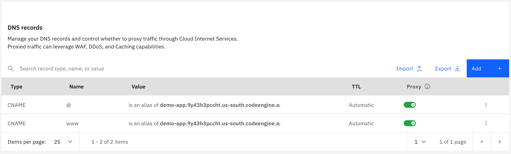
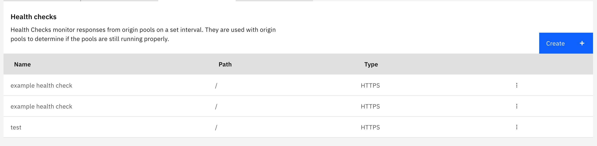
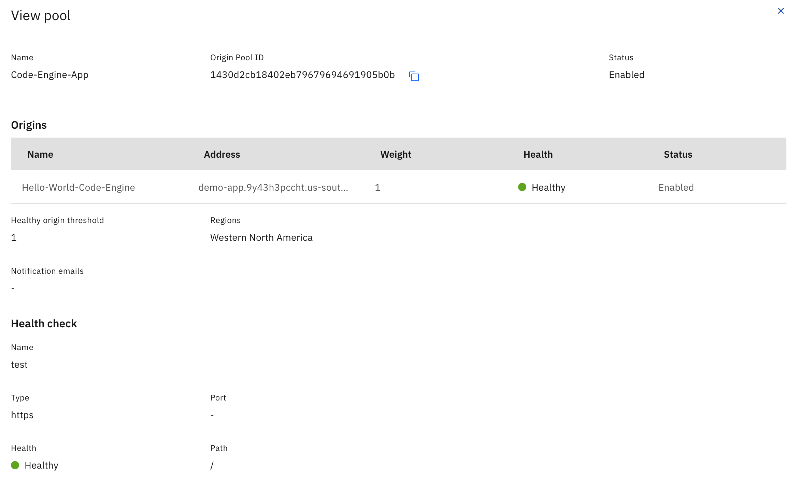
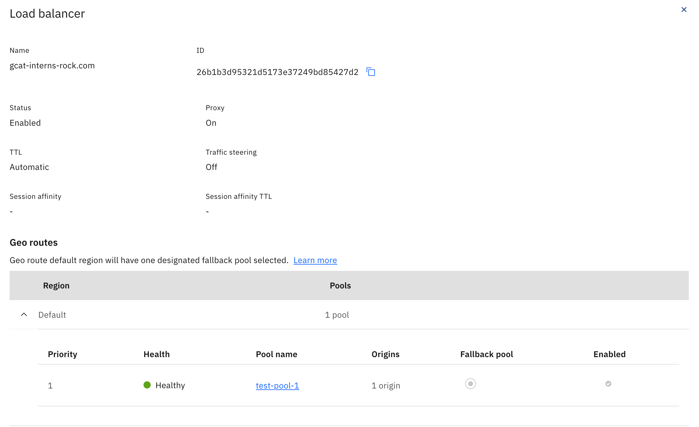

# Manual Steps
This document outlines the manual steps that were needed to connect IBM CIS and Code Engine.

## 1. Adding Domain Name to CIS Instance
Within the CIS console in the overview tab add your domain name and configure DNS records from application URL genereated from Code Engine. Two CNAME records present named `@` and `www` with their values both being the application URL. In our case, the application URL is `demo-app.9y43h3pccht.us-south.codeengine.appdomain.cloud`.

## 2. Configure Load-Balancer on CIS Instance
On the **Reliability** page first create a HTTPS health check. Name it and select HTTPS. Configure additional properties as needed.

Also on the **Reliability** page create an origin pool. Provide it a name, address, and select the health check you created. This address would be the same as the URL in the previous step. 

Next create a Load Balancer. Name it and add the origin pool you just created.

## 3. CIS Instance TLS Certificate Configuration
In the **Security** tab in CIS either upload or order the needed edge certificates for your hostname.

## 4. Edge Functions
Now edge functions (action and triggers) are added on the **Edge Functions** tab in CIS. First create an action. Second create a trigger that maps your applcations hostname with an action. For your trigge URL append `/*` to the end. For example, in our case the hostname would be `gcat-interns-rock.com/*`. Select the action you just created. 